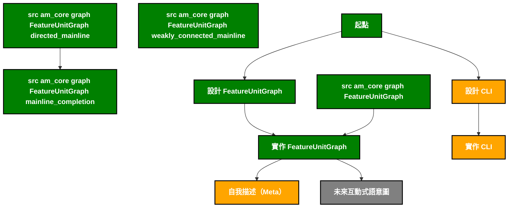

# Dependency Graph

```mermaid
graph TD
    src_am_core_graph_FeatureUnitGraph_directed_mainline["src am_core graph FeatureUnitGraph directed_mainline"]
    style src_am_core_graph_FeatureUnitGraph_directed_mainline fill:green,stroke:#333,stroke-width:1px
style src_am_core_graph_FeatureUnitGraph_directed_mainline fill:green,stroke:#000000,stroke-width:2px,color:#FFFFFF,font-weight:bold
    src_am_core_graph_FeatureUnitGraph_weakly_connected_mainline["src am_core graph FeatureUnitGraph weakly_connected_mainline"]
    style src_am_core_graph_FeatureUnitGraph_weakly_connected_mainline fill:green,stroke:#333,stroke-width:1px
style src_am_core_graph_FeatureUnitGraph_weakly_connected_mainline fill:green,stroke:#000000,stroke-width:2px,color:#FFFFFF,font-weight:bold
    src_am_core_graph_FeatureUnitGraph_mainline_completion["src am_core graph FeatureUnitGraph mainline_completion"]
    style src_am_core_graph_FeatureUnitGraph_mainline_completion fill:green,stroke:#333,stroke-width:1px
style src_am_core_graph_FeatureUnitGraph_mainline_completion fill:green,stroke:#000000,stroke-width:2px,color:#FFFFFF,font-weight:bold
    src_am_core_graph_FeatureUnitGraph_directed_mainline --> src_am_core_graph_FeatureUnitGraph_mainline_completion
    src_am_core_graph_FeatureUnitGraph["src am_core graph FeatureUnitGraph"]
    style src_am_core_graph_FeatureUnitGraph fill:green,stroke:#333,stroke-width:1px
style src_am_core_graph_FeatureUnitGraph fill:green,stroke:#000000,stroke-width:2px,color:#FFFFFF,font-weight:bold
    design_main_kickoff["起點"]
    style design_main_kickoff fill:green,stroke:#333,stroke-width:1px
style design_main_kickoff fill:green,stroke:#000000,stroke-width:2px,color:#FFFFFF,font-weight:bold
    design_feature_unit_graph["設計 FeatureUnitGraph"]
    style design_feature_unit_graph fill:green,stroke:#333,stroke-width:1px
style design_feature_unit_graph fill:green,stroke:#000000,stroke-width:2px,color:#FFFFFF,font-weight:bold
    design_main_kickoff --> design_feature_unit_graph
    implement_feature_unit_graph["實作 FeatureUnitGraph"]
    style implement_feature_unit_graph fill:green,stroke:#333,stroke-width:1px
style implement_feature_unit_graph fill:green,stroke:#000000,stroke-width:2px,color:#FFFFFF,font-weight:bold
    design_feature_unit_graph --> implement_feature_unit_graph
    src_am_core_graph_FeatureUnitGraph --> implement_feature_unit_graph
    design_cli["設計 CLI"]
    style design_cli fill:orange,stroke:#333,stroke-width:1px
style design_cli fill:orange,stroke:#000000,stroke-width:2px,color:#FFFFFF,font-weight:bold
    design_main_kickoff --> design_cli
    implement_cli["實作 CLI"]
    style implement_cli fill:orange,stroke:#333,stroke-width:1px
style implement_cli fill:orange,stroke:#000000,stroke-width:2px,color:#FFFFFF,font-weight:bold
    design_cli --> implement_cli
    design_meta_self_description["自我描述（Meta）"]
    style design_meta_self_description fill:orange,stroke:#333,stroke-width:1px
style design_meta_self_description fill:orange,stroke:#000000,stroke-width:2px,color:#FFFFFF,font-weight:bold
    implement_feature_unit_graph --> design_meta_self_description
    future_interactive_graph["未來互動式語意圖"]
    style future_interactive_graph fill:gray,stroke:#333,stroke-width:1px
style future_interactive_graph fill:gray,stroke:#000000,stroke-width:2px,color:#FFFFFF,font-weight:bold
    implement_feature_unit_graph --> future_interactive_graph
```