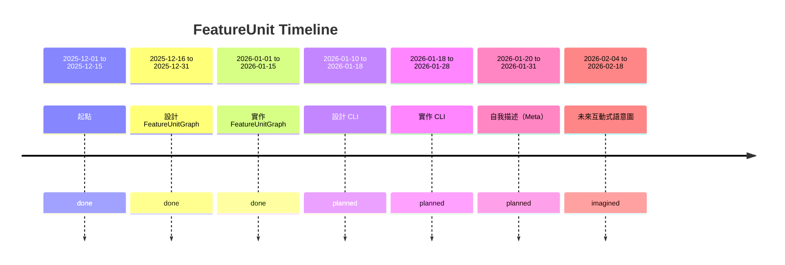
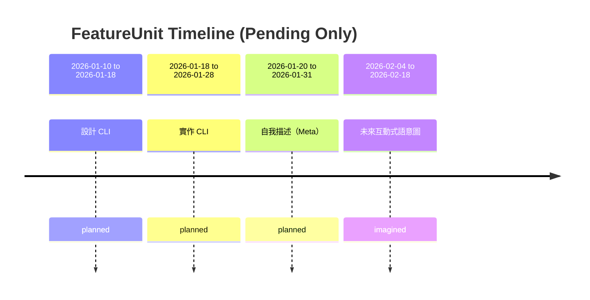

# Timeline

# Timeline

## Units without complete time information:
- src.am_core.graph.FeatureUnitGraph.directed_mainline (done): start: N/A, end: N/A
- src.am_core.graph.FeatureUnitGraph.weakly_connected_mainline (done): start: N/A, end: N/A
- src.am_core.graph.FeatureUnitGraph.mainline_completion (done): start: N/A, end: N/A
- src.am_core.graph.FeatureUnitGraph (done): start: N/A, end: N/A

# Timeline (Pending Only)

# Timeline

