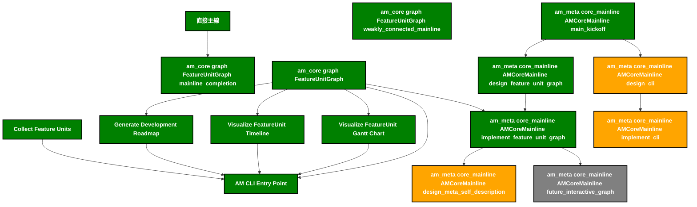

```mermaid
graph TD
    am_core_feature_collector_collect_feature_units["Collect Feature Units"]
    style am_core_feature_collector_collect_feature_units fill:green,stroke:#333,stroke-width:1px
style am_core_feature_collector_collect_feature_units fill:green,stroke:#000000,stroke-width:2px,color:#FFFFFF,font-weight:bold
    am_core_graph_FeatureUnitGraph_directed_mainline["直接主線"]
    style am_core_graph_FeatureUnitGraph_directed_mainline fill:green,stroke:#333,stroke-width:1px
style am_core_graph_FeatureUnitGraph_directed_mainline fill:green,stroke:#000000,stroke-width:2px,color:#FFFFFF,font-weight:bold
    am_core_graph_FeatureUnitGraph_weakly_connected_mainline["am_core graph FeatureUnitGraph weakly_connected_mainline"]
    style am_core_graph_FeatureUnitGraph_weakly_connected_mainline fill:green,stroke:#333,stroke-width:1px
style am_core_graph_FeatureUnitGraph_weakly_connected_mainline fill:green,stroke:#000000,stroke-width:2px,color:#FFFFFF,font-weight:bold
    am_core_graph_FeatureUnitGraph_mainline_completion["am_core graph FeatureUnitGraph mainline_completion"]
    style am_core_graph_FeatureUnitGraph_mainline_completion fill:green,stroke:#333,stroke-width:1px
style am_core_graph_FeatureUnitGraph_mainline_completion fill:green,stroke:#000000,stroke-width:2px,color:#FFFFFF,font-weight:bold
    am_core_graph_FeatureUnitGraph_directed_mainline --> am_core_graph_FeatureUnitGraph_mainline_completion
    am_core_graph_FeatureUnitGraph["am_core graph FeatureUnitGraph"]
    style am_core_graph_FeatureUnitGraph fill:green,stroke:#333,stroke-width:1px
style am_core_graph_FeatureUnitGraph fill:green,stroke:#000000,stroke-width:2px,color:#FFFFFF,font-weight:bold
    am_core_feature_report_generate_roadmap["Generate Development Roadmap"]
    style am_core_feature_report_generate_roadmap fill:green,stroke:#333,stroke-width:1px
style am_core_feature_report_generate_roadmap fill:green,stroke:#000000,stroke-width:2px,color:#FFFFFF,font-weight:bold
    am_core_graph_FeatureUnitGraph --> am_core_feature_report_generate_roadmap
    am_core_feature_visualize_visualize_timeline["Visualize FeatureUnit Timeline"]
    style am_core_feature_visualize_visualize_timeline fill:green,stroke:#333,stroke-width:1px
style am_core_feature_visualize_visualize_timeline fill:green,stroke:#000000,stroke-width:2px,color:#FFFFFF,font-weight:bold
    am_core_graph_FeatureUnitGraph --> am_core_feature_visualize_visualize_timeline
    am_core_feature_visualize_visualize_gantt["Visualize FeatureUnit Gantt Chart"]
    style am_core_feature_visualize_visualize_gantt fill:green,stroke:#333,stroke-width:1px
style am_core_feature_visualize_visualize_gantt fill:green,stroke:#000000,stroke-width:2px,color:#FFFFFF,font-weight:bold
    am_core_graph_FeatureUnitGraph --> am_core_feature_visualize_visualize_gantt
    am_core_cli_main["AM CLI Entry Point"]
    style am_core_cli_main fill:green,stroke:#333,stroke-width:1px
style am_core_cli_main fill:green,stroke:#000000,stroke-width:2px,color:#FFFFFF,font-weight:bold
    am_core_feature_collector_collect_feature_units --> am_core_cli_main
    am_core_graph_FeatureUnitGraph --> am_core_cli_main
    am_core_feature_report_generate_roadmap --> am_core_cli_main
    am_core_feature_visualize_visualize_timeline --> am_core_cli_main
    am_core_feature_visualize_visualize_gantt --> am_core_cli_main
    am_meta_core_mainline_AMCoreMainline_main_kickoff["am_meta core_mainline AMCoreMainline main_kickoff"]
    style am_meta_core_mainline_AMCoreMainline_main_kickoff fill:green,stroke:#333,stroke-width:1px
style am_meta_core_mainline_AMCoreMainline_main_kickoff fill:green,stroke:#000000,stroke-width:2px,color:#FFFFFF,font-weight:bold
    am_meta_core_mainline_AMCoreMainline_design_feature_unit_graph["am_meta core_mainline AMCoreMainline design_feature_unit_graph"]
    style am_meta_core_mainline_AMCoreMainline_design_feature_unit_graph fill:green,stroke:#333,stroke-width:1px
style am_meta_core_mainline_AMCoreMainline_design_feature_unit_graph fill:green,stroke:#000000,stroke-width:2px,color:#FFFFFF,font-weight:bold
    am_meta_core_mainline_AMCoreMainline_main_kickoff --> am_meta_core_mainline_AMCoreMainline_design_feature_unit_graph
    am_meta_core_mainline_AMCoreMainline_implement_feature_unit_graph["am_meta core_mainline AMCoreMainline implement_feature_unit_graph"]
    style am_meta_core_mainline_AMCoreMainline_implement_feature_unit_graph fill:green,stroke:#333,stroke-width:1px
style am_meta_core_mainline_AMCoreMainline_implement_feature_unit_graph fill:green,stroke:#000000,stroke-width:2px,color:#FFFFFF,font-weight:bold
    am_meta_core_mainline_AMCoreMainline_design_feature_unit_graph --> am_meta_core_mainline_AMCoreMainline_implement_feature_unit_graph
    am_core_graph_FeatureUnitGraph --> am_meta_core_mainline_AMCoreMainline_implement_feature_unit_graph
    am_meta_core_mainline_AMCoreMainline_design_cli["am_meta core_mainline AMCoreMainline design_cli"]
    style am_meta_core_mainline_AMCoreMainline_design_cli fill:orange,stroke:#333,stroke-width:1px
style am_meta_core_mainline_AMCoreMainline_design_cli fill:orange,stroke:#000000,stroke-width:2px,color:#FFFFFF,font-weight:bold
    am_meta_core_mainline_AMCoreMainline_main_kickoff --> am_meta_core_mainline_AMCoreMainline_design_cli
    am_meta_core_mainline_AMCoreMainline_implement_cli["am_meta core_mainline AMCoreMainline implement_cli"]
    style am_meta_core_mainline_AMCoreMainline_implement_cli fill:orange,stroke:#333,stroke-width:1px
style am_meta_core_mainline_AMCoreMainline_implement_cli fill:orange,stroke:#000000,stroke-width:2px,color:#FFFFFF,font-weight:bold
    am_meta_core_mainline_AMCoreMainline_design_cli --> am_meta_core_mainline_AMCoreMainline_implement_cli
    am_meta_core_mainline_AMCoreMainline_design_meta_self_description["am_meta core_mainline AMCoreMainline design_meta_self_description"]
    style am_meta_core_mainline_AMCoreMainline_design_meta_self_description fill:orange,stroke:#333,stroke-width:1px
style am_meta_core_mainline_AMCoreMainline_design_meta_self_description fill:orange,stroke:#000000,stroke-width:2px,color:#FFFFFF,font-weight:bold
    am_meta_core_mainline_AMCoreMainline_implement_feature_unit_graph --> am_meta_core_mainline_AMCoreMainline_design_meta_self_description
    am_meta_core_mainline_AMCoreMainline_future_interactive_graph["am_meta core_mainline AMCoreMainline future_interactive_graph"]
    style am_meta_core_mainline_AMCoreMainline_future_interactive_graph fill:gray,stroke:#333,stroke-width:1px
style am_meta_core_mainline_AMCoreMainline_future_interactive_graph fill:gray,stroke:#000000,stroke-width:2px,color:#FFFFFF,font-weight:bold
    am_meta_core_mainline_AMCoreMainline_implement_feature_unit_graph --> am_meta_core_mainline_AMCoreMainline_future_interactive_graph
```